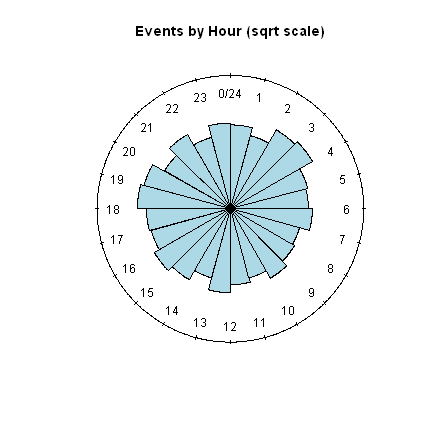
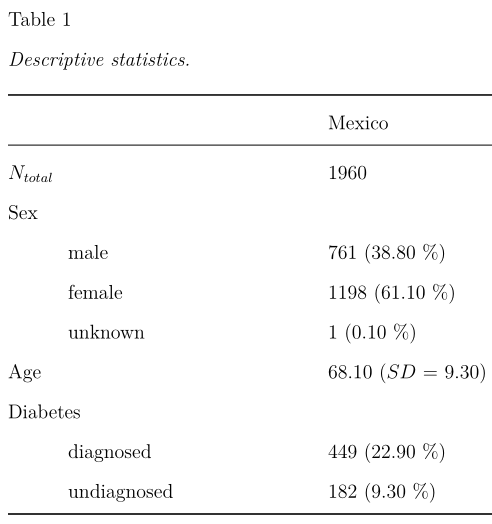
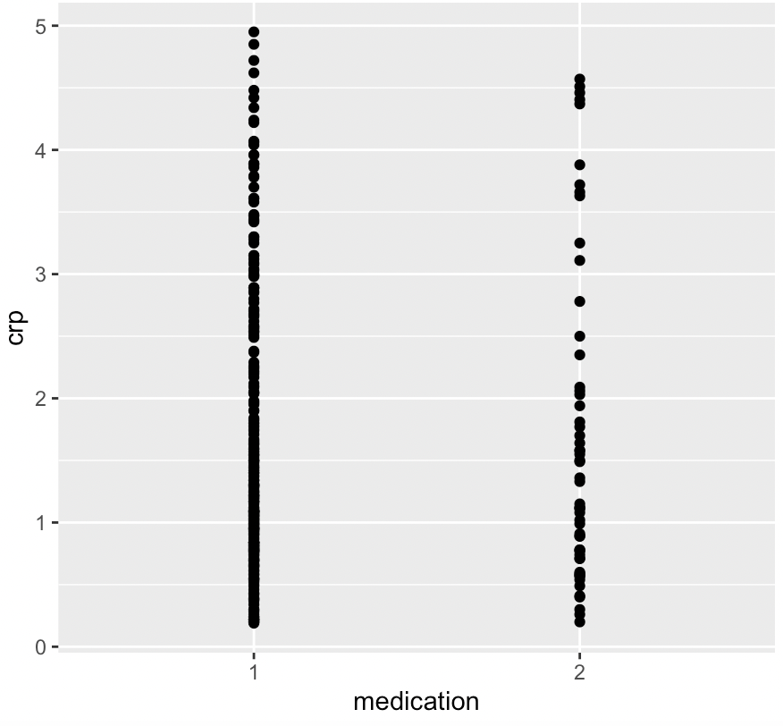
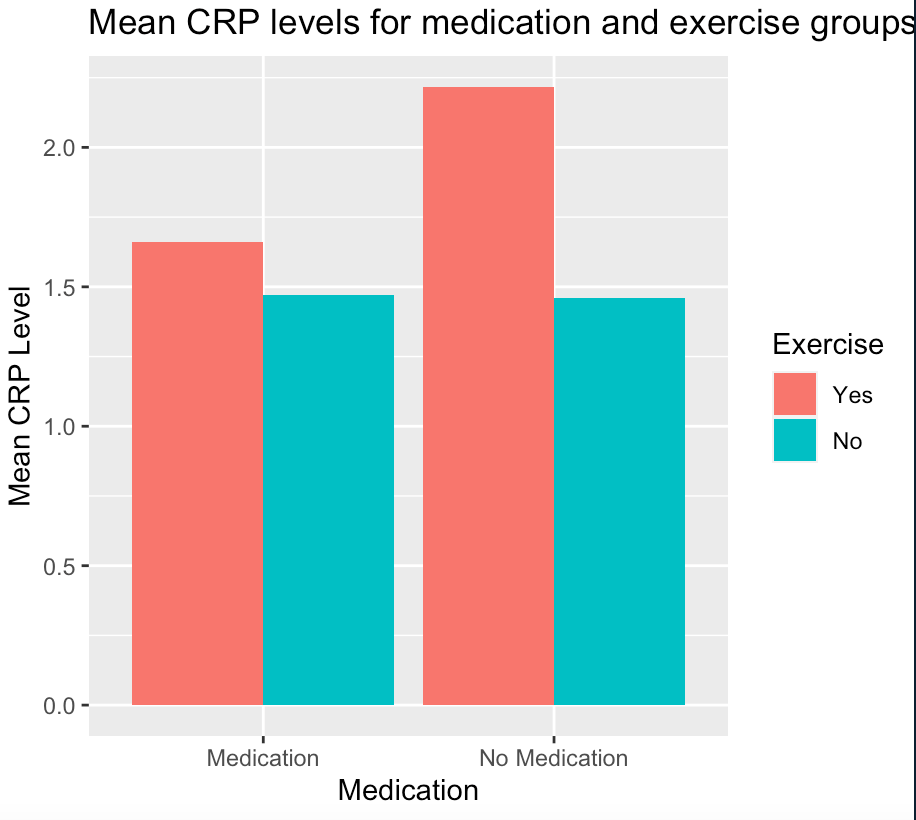
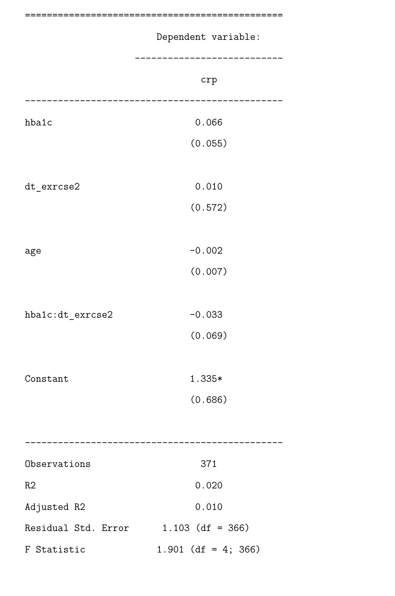

```{r setup, include=FALSE}
options(htmltools.dir.version = FALSE)

knitr::opts_chunk$set(echo = TRUE,
                      message = FALSE,
                      warning = FALSE,
                      cache = TRUE,
                      fig.width = 12)

library(xaringan)
library(xaringanExtra)
library(xaringanthemer)
library(tidyverse)
library(knitr)
library(here)
library(rio)
library(kableExtra)

```

```{r xaringan-themer, include=FALSE, warning=FALSE}
#This is all code that sets the theme for the entire presentation. 

style_duo_accent(
  primary_color = "#3e1f79",
  secondary_color = "#791f5e",
  header_font_google = xaringanthemer::google_font("Atkinson Hyperlegible", "600"),
  text_font_google   = xaringanthemer::google_font("Atkinson Hyperlegible", "300", "300i"),
  code_font_google   = xaringanthemer::google_font("IBM Plex Mono"),
  colors = c(
    darkblue = "#0072B2",
    lightblue = "#56B4E9",
    darkorange = "#D55E00",
    lightorange = "#E69f00",
    yellow = "#f0e442",
    green = "#009E73",
    pink = "#CC79A7",
    gray = "#99999",
    white = "#FFFFFF"
  )
)

```

```{r instructions, echo=FALSE, eval=FALSE, out.width="50%"}

#A dashed line (---) represents the start of a new slide. A hashtag (#) represents a heading. An asterisks (*) represents a bullet point. A double asterisks (**) turns the fond bold. And within each slide, you have option of adding in any r code you want to bring in graphs or images, using the typical hash marks (```).

--- begin new slide

# Heading

* bullet 1
* bullet 2
* bullet 3
    * sub bullet 1
    * sub bullet 2

**bold comment**
  
--- begin new slide

#Code to pull in an image (if you want to bring in images or screenshots):
knitr::include_graphics("image.png")

```


```{r include=FALSE}

data <- import(here("data","mexico_raw_dat.csv")) %>% as_tibble #Importing the Mexico dataset
dat <- data
#data <- data %>% select(sex, diagnosis, age, hba1c, crp, medication, dt_exrcse, q5026, q5027) %>% rename(access = q5026) %>% filter(age >=50 & (diagnosis == 1 | crp < 5))  %>% as_tibble 

#Selecting only relevant variables, renaming for clarification, and filtering for people with a diabetes diagnosis and high levels of inflammation (crp).

 #Importing the Mexico dataset
data <- data %>% 
  select(sex, diagnosis, age, hba1c, crp, medication, dt_exrcse,    q5026, q5027) %>% 
  rename(access = q5026) %>% 
  filter(age >=50 & diagnosis == 1 & crp < 5) %>% as_tibble 


data <- data %>%
  mutate(sex = as.factor(sex),
         diagnosis = as.factor(diagnosis),
         medication = as.factor(medication),
         dt_exrcse = as.factor(dt_exrcse),
         access = as.factor(access))

dat <- dat %>%
  mutate(diabetes_stat=case_when(
    hba1c >= 6.5 & diagnosis==2 ~ "undiagnosed",
    diagnosis==1 ~ "diagnosed",
    hba1c < 6.5  ~ "no_diabetes"))


```


---
  # Outline

* Dominik Grätz
* Rachel Miller-Moudgil
* Amber Somarriba
* Brittany Spinner
* Tian Walker

**Challenges and successes with data cleaning, models, and graphs!**
  
---
  
# Dominik Grätz - Journey
  
* I knew some basics about coding in R, but did not make full use of the `{tidyverse}`

  * Before, I have used functions from the `{plyr}` package 
    <br> &rarr; `{tidyverse}` functions make life so much easier!
    
  * For filtering, for example, I still like to use indexing instead of using `filter()`, but mostly because I am more used to that and can code faster that way (for now):
  
```{r eval = FALSE}
data <- data[is.na(data$Response),] #vs.
data <- data %>% filter(!is.na(Response))
```

* Similarly, I still sometimes use base R column manipulation instead of `mutate()` when I think it's faster.

```{r eval = FALSE}
data$RT <- data$RT * 2 #vs.
data <- data %>% 
  mutate(RT = RT * 2)
```

---

# Dominik Grätz - Challenges faced

* Sometimes, Markdown is FRUSTRATING, but I love the output and cleanliness.

* I need to learn more about tables - I made the table below by hand because I couldn't figure out how to do it with existing packages...

```{r echo=FALSE, out.width = "60%",fig.align = "center"}
knitr::include_graphics("table.png") 
```

* Collaboration was great! We took some time to boil the questions down, but it was a great working with a team having experiences in different areas!
* I am not certain I fully understand some Github vocabulary...

---

# Dominik Grätz - Next hurdles

* In the future, for my work, I would like to produce plots like this (but nice): 
```{r echo=FALSE, out.width = "30%",fig.align = "center"}
 
```
* I have not found a package that produces nice circular (rose) plots may need to switch to Matlab for that?
--

* I also want to produce appealing interactive maps that display information about voting, demographics, prevalence of illnesses, things like that. <br> &rarr; Excited for the data viz class!
--

* Learning more about building websites and slides in R!

---

# Dominik Grätz - Findings

I produced this table: 

.pull-left[
* based on the representative WHO sample we used, after all cleaning and filtering has applied.
* originally, we thought about comparing Mexico with China
* filtered out people under 50, that's why the age is so high
* Sex was "observed" by the investigators
* Sex seems to be not adequately represented (although not tested for significance)
  * could be problematic, especially with health variables
* undiagnosed Diabetes defined as elevated blood sugar (hba1c > 6.5)
]

.pull-right[
```{r echo=FALSE, out.width = "100%"}
 
```
]
---
  
  # Rachel Miller-Moudgil (1/3)
  
  **Using experimental vs. secondary data**
  
  * I usually work with experimental data,  where throughout the research process I've had control over variables and measurement. Using secondary data means:
  
    * Takes hours to understand the data 
    
    * Takes hours to figure out which variables are relevant

```{r Rachel_image1, echo=FALSE, out.width = "50%", fig.align = "center", eval=FALSE}

# Code or image showing messy variables transformed into clean

knitr::include_graphics("Group_presentation/Rachels_images/colnames_original.png") #Stuck on error message "cannot find the file(s)"

```
---

# Rachel Miller-Moudgil (1/3)

**Using experimental vs. secondary data**

* I usually work with experimental data, where throughout the research process I've had control over variables and measurement. Using secondary data means:

    * Taking hours to understand the data 
    
    * Taking hours to figure out which variables are relevant

```{r Rachel_image2, echo=FALSE, out.width = "50%", fig.align = "center", eval=FALSE}

# Code or image showing messy variables transformed into clean

knitr::include_graphics("Group_presentation/Rachels_images/colnames_new.png") #Stuck on error message "cannot find the file(s)"

```

---
  
  # Rachel Miller-Moudgil (1/3)
  
  **Using experimental vs. secondary data**
  
  * I usually work with experimental data, where throughout the research process I've had control over variables and measurement. Using secondary data means:
  
    * Taking hours to understand the data 
    
    * Taking hours to figure out which variables are relevant
    
    * Not everything is measured the way you wish it was

```{r Rachel_image3, echo=FALSE, out.width = "50%", fig.align = "center", eval=FALSE}

# code or image showing variable not nicely aligning with our construct.

knitr::include_graphics("Group_presentation/Rachels_images/access_variables.png") #Stuck on error message "cannot find the file(s)"

```

---

# Rachel Miller-Moudgil (2/3)

**Working alone vs. with others**

* Unfamiliar research area = steep learning curve

* Workflow kinks (e.g., merge issues, forgetting to push to GitHub, modeling and graphing dependent on data cleaning)

* Having others who know code that you don't, and who can double-check your code with fresh eyes (shout out to Tian and Dominik!)

```{r}

#INSERT ANY RELEVANT CODE YOU WANT TO SHOW HERE

#knitr::include_graphics("image.png") <-- use this code to insert any image you want

```
---

# Rachel Miller-Moudgil (3/3)

**My next R hurdle**

* Pivot_longer and pivot_wider: concept & code

* Reviewing citation packages & code

```{r }

#INSERT ANY RELEVANT CODE YOU WANT TO SHOW HERE

#knitr::include_graphics("image.png") <-- use this code to insert any image you want

```

---
# Amber Somarriba
* I came into this class with little to no experience with R, but it was a skill I wanted to build before furthering my education within the field of psychology! This project allowed me to practice and reinforce my understanding of the concepts that we learned, while also giving me ideas about the ways I can apply these tools towards my own projects.


* Although there have been challenges, such as  learning how to make intelligible graphs and how to collaborate using GitKraken, this project has made me grow all the more excited about the possibilities of working with R in the real world.

* With this project for example, being able to use real-world data to visualize trends and get a deeper understanding of a ubiquitous disease within a certain population was very exciting.
---
* Specifically, being able to turn a plot like this: 
```{r Amber Image, echo=FALSE, out.width = "40%",fig.align = "center"}

```
Into this: 
```{r echo=FALSE, out.width = "50%",fig.align = "center"}

```

--- 
---
* I also was able to learn how to make my first regression table (with the help of Dominik and Stack Overflow) using the {stargazer} package! 

```{r echo=FALSE, out.width = "40%",fig.align = "center"}

```
* Moving forward, I hope to continue to be able to use R for my academic projects and beyond!
<<<<<<< Updated upstream
=======
---


* Presentation cover the following:
  
    * Share your journey (everyone, at least for a minute or two)

    * Discuss challenges you had along the way

    * Celebrate your successes

    * Discuss challenges you are still facing

    * Discuss substantive findings
>>>>>>> Stashed changes

---

# Brittany Spinner (1/3)
**Journey**
* This is my very first introduction to R. 
  - I have previous experience working with SPSS only
    + using data that was created from Qualtrics surveys and 
  - I help collect and manage data for a longitudinal study 
  - I'm in my second year of the MS program in Prevention Science

**Challenges**
* Trying to remember to contextual differences between the little things:
  - filtering versus selecting
  - knowing when to use + or %>%, '' or "", or | or &
    + (or any of the many little changes from one function/{package} to another)
    + Ultimately figuring out the one _little_ thing that didn't allow your code to run
  - Not knowing all the functions
    + and the appropriate layout for data, variable names, etc. for that function
* Not having direct access to a codebook (or a good one)

---

**Successes**
* Formatting in R
* Basic R 
* Statistical analysis/assumptions about data 
* Active teammates:
  - We all really cared about this project!
  - Willing to answer each other's questions and help
  
---

# Brittany Spinner (2/3)
**RQ and Finding(s)**
* RQ3: Are Mexicans 50 years of age and older, with diabetes, and utilizing the treatment diet and/or exercise, experiencing statistically significant differences in CRP (inflammation) levels between those that have been to a Dr. in the last year versus those that have not?
  - Measuring healthcare access/utilization (IV) on CRP levels (DV)
  - Conducting a Chi-square test of independence 
    + looking at differences between observed versus expected values for this relationship
* First I wanted to show the proportion differences of these individuals that had been to the Dr. in the last year or not 
  - with a bar chart
* Second show proportion differences in CRP levels (low vs. high) for this population 
  - with a bar chart 
* Then conduct a Chi-square analysis to measure differences 

---

**Challenges Ahead Still**
* Finishing my Chi-square analysis 
  - filtering my variables so they will represent what is reflective in my research question (RQ3)
    + transforming crp into a dichotomous variable
  - RQ3df$crp <- factor(RQ3df$crp, 
                    levels = c(0:3 & 3.1:6.5), labels = c("Low", "High")) #need help getting this to work
* Making a pretty table and bar chart

**Current R Figures and Code**
```{r proportion_bar, echo=TRUE, eval=TRUE, include=TRUE, }

#idk why this isn't working 
#knitr::include_graphics("proportion_access.png")
```

*Chi-Square code*
* chi_df <- chisq.test(RQ3df$access, RQ3df$crp) run chi between dfs of data$care and data$crp, but this is the code 
* chi_df
* chi_df$expected
* chi_df$observed 
* Create table with observed and expected values 

---

#Brittany Spinner (3/3)
**Code**
* table(RQ3df$access)
* table(RQ3df$crp)
* prop <- prop.table(table(RQ3df$access))
* RQ3_barplot <- barplot(prop, xlab = "Individuals 50yo or older with Diabetes that partake in Diet&/Exercise and saw a Dr. in the Last Year", ylab = "Proportion of Individuals") #need to add title and subtitle(?)

* chi_df <- chisq.test(RQ3df$access, RQ3df$crp) #need to get rid of NA values in care and possible create two dfs with yes no and then run chi between dfs of data$care but this is the code 
* chi_df
* chi_df$expected
* chi_df$observed 

**Next R Hurdle**
* Milestone paper
* Specialization Data Science sequence
* Apply for the Prev Sci PhD program and QRME PhD program
* Do work! Apply what I've learned in meaningful ways

---

# Tian 

    Coding Challenges

  * create a variable with 3 levels (case_when)
  
  * creating bar graphs (geom_bar vs. geom_col)
  
    * telling ggplot to color by a dichotomous variable that R thinks is continuous
  
  * loading in duplicate variables that are empty
  
  * learning how to read between the lines with error messages 
  
---

# Challenges
--
background-size: contain

background-image: url("https://assets.entrepreneur.com/content/3x2/2000/1638079565-Untitleddesign-2021-11-28T100532825.png?auto=webp&quality=95&crop=16:9&width=675")

---

class: inverse, middle, center

```{r echo=FALSE, out.width="50%"}

```

photo credit: Allison Horst(https://github.com/allisonhorst/stats-illustrations)

---


background-size: contain

background-image: url("https://www.mountsinai.on.ca/care/lscd/sweet-talk-1/images-and-resources/a1c_chart.gif")

---


```{r}
library(ggpubr)

plot <- dat %>% 
filter(!is.na(diabetes_stat)) %>% 
ggplot(aes(hba1c,crp))  + geom_point(aes(color = as.factor(medication )) )+ facet_wrap(~diabetes_stat)

plot + font("xlab", size = 34) + font("ylab", size = 34)+ font("xy.text", size = 25, color = "black", face = "bold") + scale_color_manual(values = c("tomato1", "purple4"))


```


---

class: inverse, middle, center

# Research Question
Does taking medication lower inflammation levels (controlling for age)? 

---
Regression we ran: Do people taking medication have a stronger relationship between inflammation and diabetes?
```{r}
data %>% 
  filter(crp <5) %>% 
  ggplot(aes(hba1c, crp)) + geom_point(aes(color = medication), alpha = 0.5) + geom_smooth(aes(color = medication), method = "lm") + scale_color_brewer(palette = 7) + theme_dark() + labs( title = "The Relationship Between Blood Sugar and Inflammation by Medication", caption =  "SAGE data from Mexico", x = "Blood Sugar (HbA1c)", y = "Inflammation (CRP)")
```

---

class: inverse, middle, center

# Why were we looking at treatment to begin with?

---
class: inverse, middle, center

```{r}
data <- data %>% 
  mutate(diabetes_treat=case_when(
    medication== 1  ~ "medication",
    dt_exrcse==1 ~ "dt_excercise",
    medication == 2  & dt_exrcse == 2 ~ "no_treatment"))

```

---


```{r}
plot.a <- data %>% 
filter(crp <5, age > 50) %>% 
 ggplot(aes(hba1c, crp)) + geom_point(aes(color = diabetes_treat), size = 5) + scale_color_brewer(palette = 15) + theme_dark()

plot.a + font("xlab", size = 34) + font("ylab", size = 34)+ font("xy.text", size = 25, color = "black", face = "bold")

```
---

# Let's zoom in!


```{r echo=FALSE}
plot.b <- data %>% 
filter(crp <5, age > 50, hba1c < 6.5) %>% 
filter(diagnosis == 1 ) %>% 
 ggplot(aes(hba1c, crp)) + geom_point(aes(color = diabetes_treat), size = 5) + scale_color_brewer(palette = 15) + theme_dark()

plot.b + font("xlab", size = 34) + font("ylab", size = 34)+ font("xy.text", size = 25, color = "black", face = "bold") 


```
---

class: inverse, middle, center

```{r echo=FALSE, out.width = "50%",fig.align = "center"}

```


---
# Looking Ahead
* Change font size on facet wrap 
* Continue getting comfortable with pivot_wider and pivot_longer
* Qualtrics and R 
* Become even better friends with google
* Increase comfort going from statistical tests to graphs
* Make lots of bar charts
* Publish a manuscript written in R

```{r echo=FALSE}
library(emoGG)

data %>% 
filter(!is.na(medication)) %>% 
  ggplot(aes(age, crp) )+ geom_point()+ 
  geom_emoji(data = data [ data$medication == 1,],emoji = "1f427") +
  geom_emoji(data = data [data$medication == 2,],emoji = "1f98b") + geom_smooth(se = FALSE, aes(group = medication, color = as.factor(medication)), size = 2, method = "lm") + scale_color_manual(values = c("dodgerblue", "black")) + theme_classic()

```

---

class: inverse, middle, center
```{r }
library(emoGG)

data %>% 
filter(!is.na(medication)) %>% 
  ggplot(aes(age, crp) )+ geom_point()+ 
  geom_emoji(data = data [ data$medication == 1,],emoji = "1f427") +
  geom_emoji(data = data [data$medication == 2,],emoji = "1f98b") + geom_smooth(se = FALSE, aes(group = medication, color = as.factor(medication)), size = 2, method = "lm") + scale_color_manual(values = c("dodgerblue", "black")) + theme_classic() + labs(title = "Does taking medication lower inflammation levels (controlling for age)? ")

```

---

class: inverse, middle, center

# **Questions?**

---
# Credits

**adapted from EDLD 651 slides**

` packages that we used `

```{r}

#install.packages("here")
library(xaringan)
library(xaringanExtra)
library(xaringanthemer)
library(tidyverse)
library(knitr)
library(here)
library(rio)
library(kableExtra)
library(ggpubr)
library(emoGG)

```


